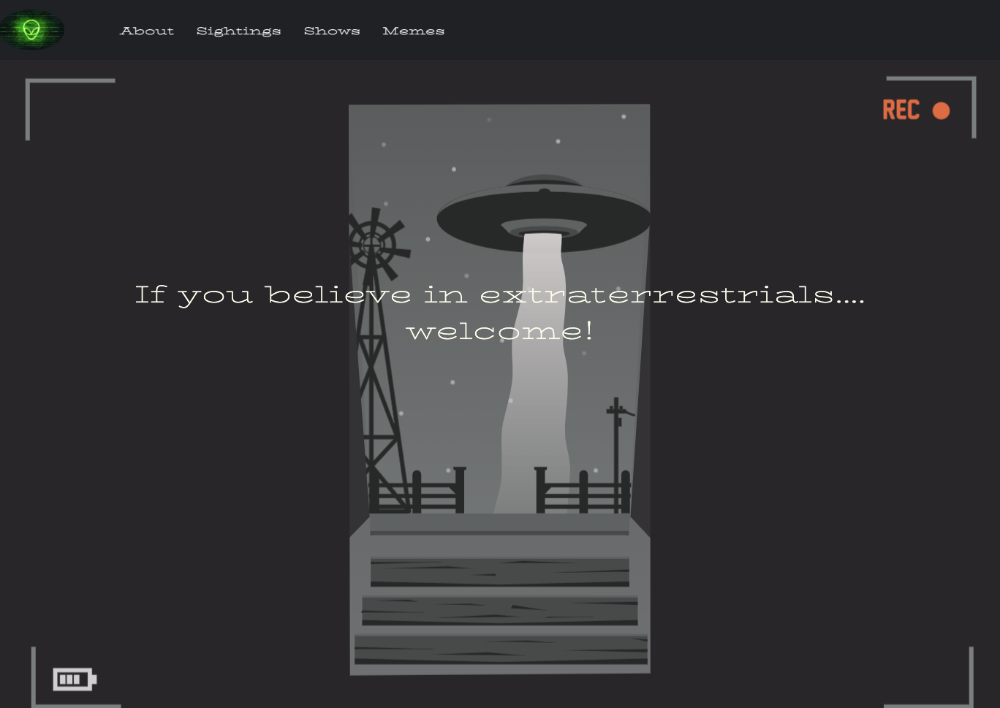

# UFO Sightings 👽👽👽

## Description
If you are an alien enthusiast, this is the site for you. You can explore more about famous sightings and interesting facts about alien or UFO lore. 

### Instructions

- Fork this repository
- Clone your forked repository
- Add your scripts
- Commit and push
- Create a pull request
- Star this repository
- Wait for pull request to merge
- Celebrate your first step into the open source world and contribute more

<h3 align="left">Languages and Tools:</h3>

       
